# GymPal Backend API - Architecture Documentation

## Overview

GymPal Backend is a comprehensive RESTful API built with **Hono**, **TypeScript**, and **Supabase** for a fitness tracking application with social features. The API provides endpoints for user authentication, workout management, exercise tracking, social interactions, and analytics.

## Table of Contents

- [Architecture Overview](#architecture-overview)
- [Technology Stack](#technology-stack)
- [Project Structure](#project-structure)
- [Request Flow](#request-flow)
- [Authentication Flow](#authentication-flow)
- [Database Schema](#database-schema)
- [Module Architecture](#module-architecture)
- [API Endpoints](#api-endpoints)

## Architecture Overview

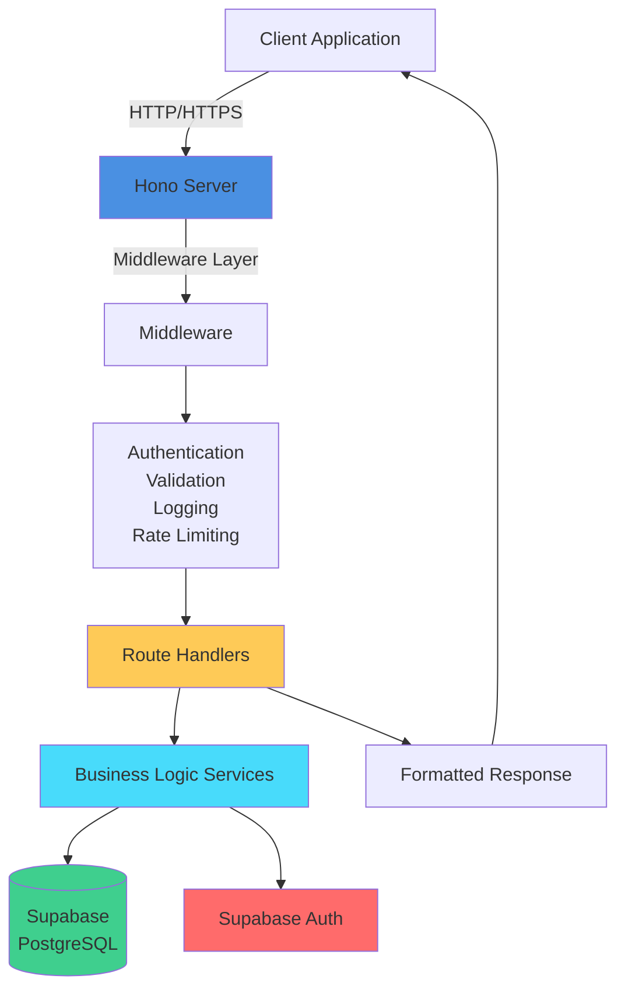

## Technology Stack

### Core Framework
- **Hono**: Fast, lightweight web framework for the edge
- **TypeScript**: Type-safe JavaScript
- **Node.js**: Runtime environment

### Database & Auth
- **Supabase**: PostgreSQL database with built-in auth
- **PostgreSQL**: Relational database
- **Row Level Security (RLS)**: Database-level security

### Additional Tools
- **Zod**: Schema validation
- **Pino**: Logging
- **Nodemailer**: Email notifications

## Project Structure

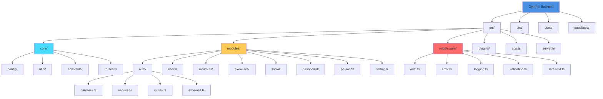

## Request Flow

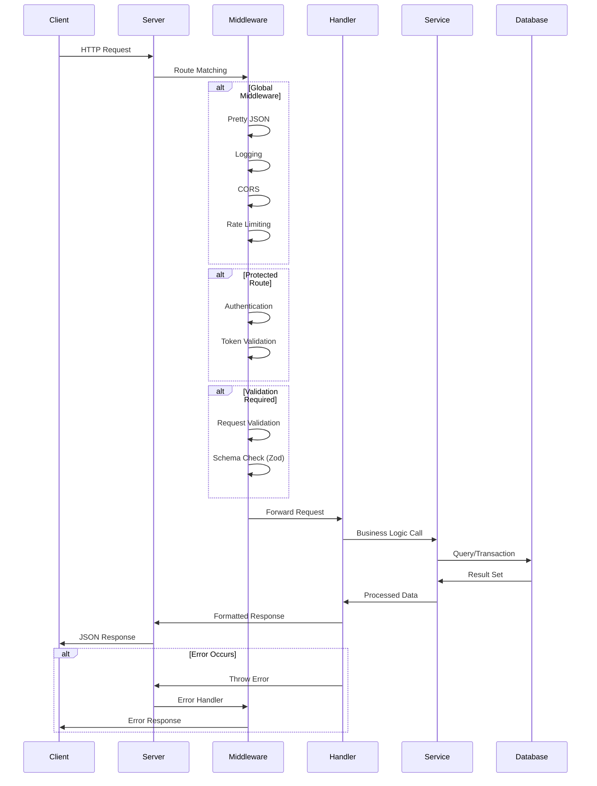

## Authentication Flow

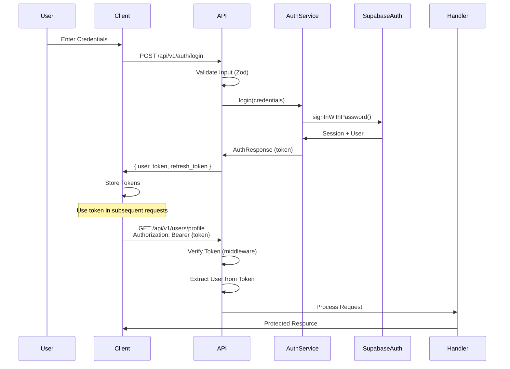

## Module Architecture

Each module follows a consistent structure:

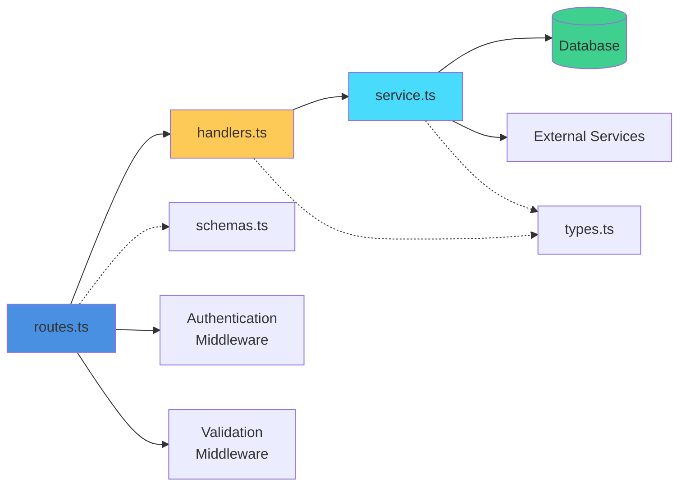

### Module Responsibilities

1. **routes.ts**: Defines HTTP endpoints, applies middleware, connects routes to handlers
2. **handlers.ts**: HTTP request handlers that process requests, call services, format responses
3. **service.ts**: Business logic layer that interacts with database and external services
4. **schemas.ts**: Zod validation schemas for request/response validation
5. **types.ts**: TypeScript type definitions for the module

## Database Schema

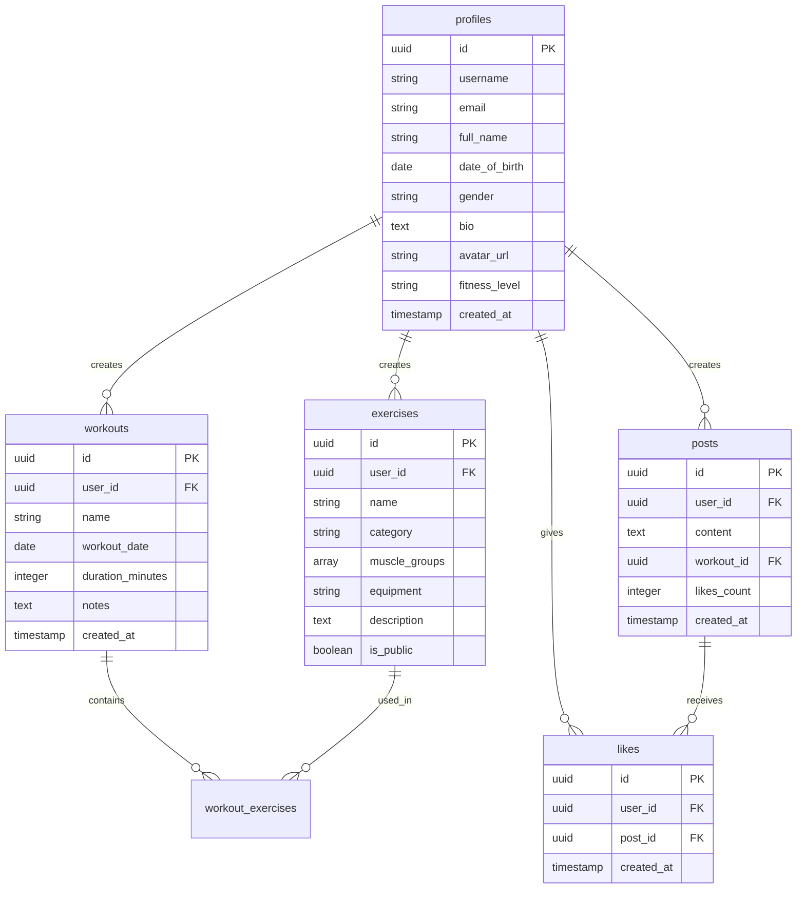

## API Endpoints

### Authentication Module (`/api/v1/auth`)

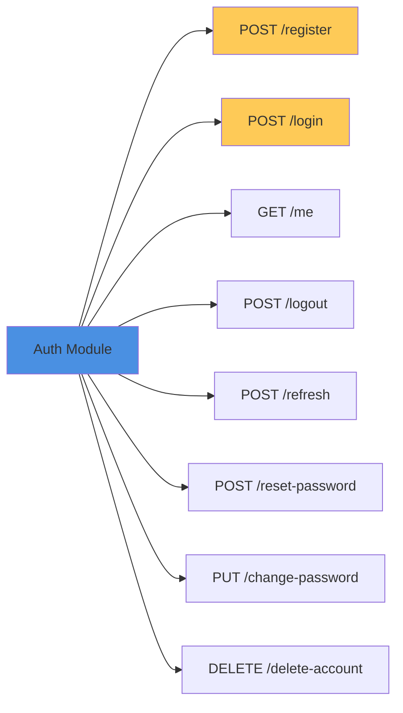

### Users Module (`/api/v1/users`)

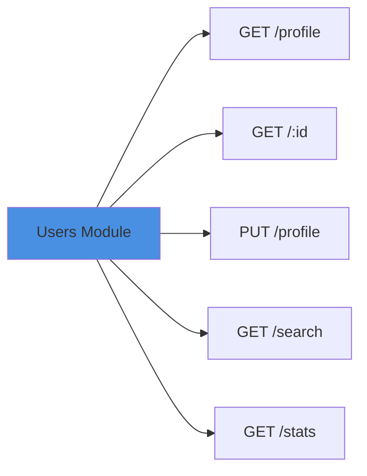

### Workouts Module (`/api/v1/workouts`)

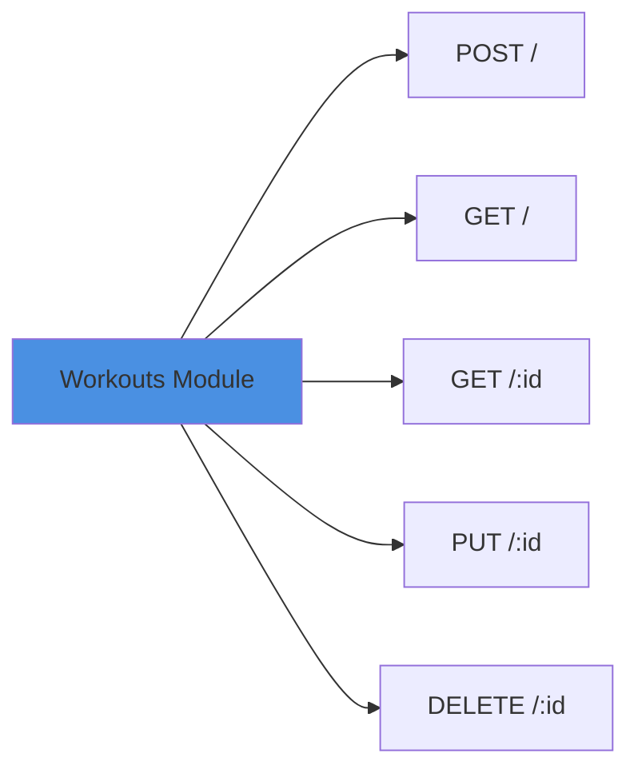

### Exercises Module (`/api/v1/exercises`)

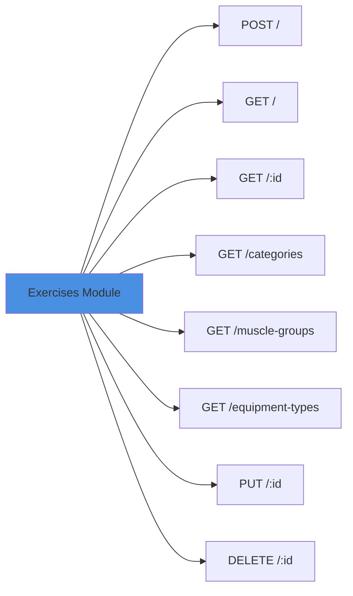

### Social Module (`/api/v1/social`)

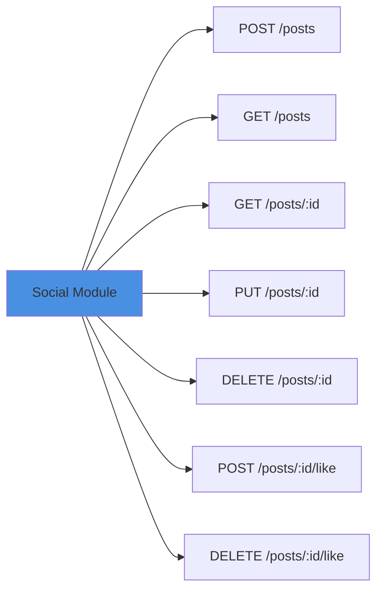

### Dashboard Module (`/api/v1/dashboard`)

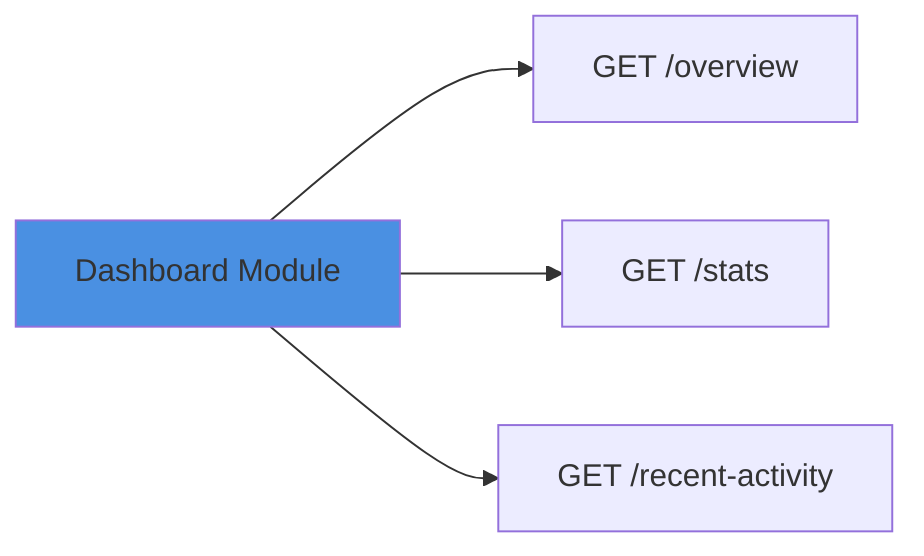

## Error Handling Flow

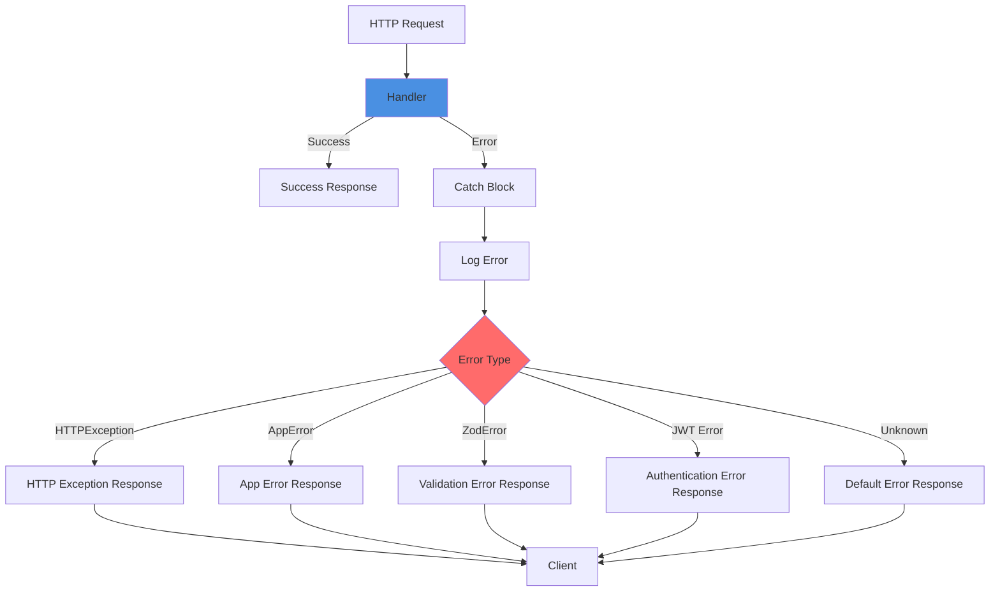

## Security Layers

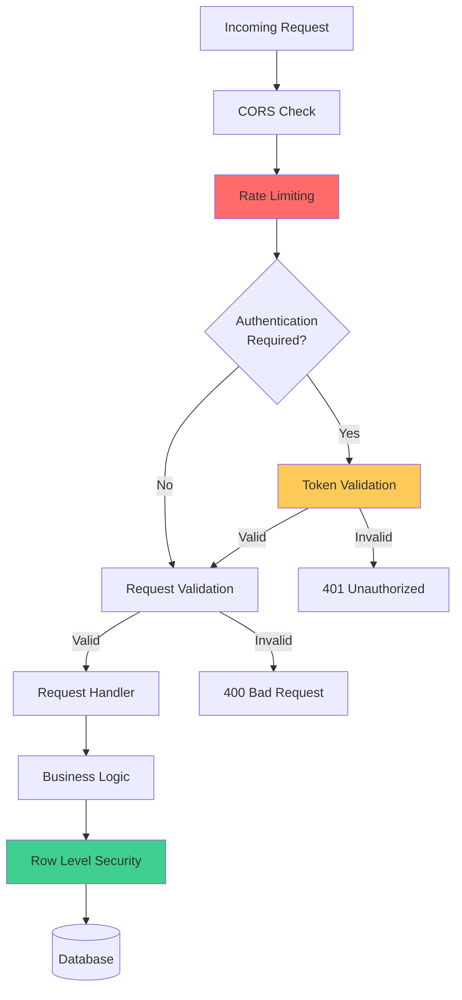

## Deployment Architecture

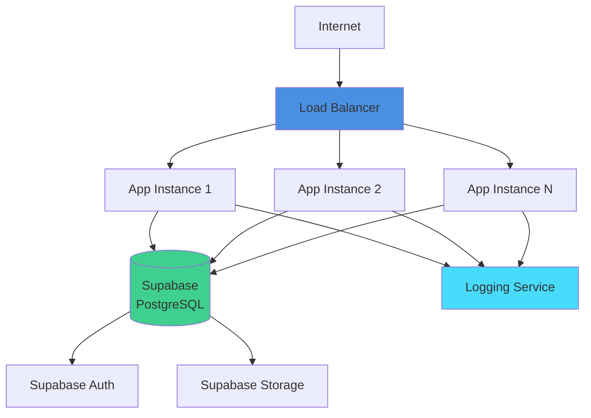

---

## API Response Formats

### Standard Response Structure

All API endpoints follow a consistent response format:

```json
{
  "success": true,
  "message": "Optional success message",
  "data": { ... },
  "metadata": {
    "timestamp": "2024-01-15T10:30:00Z"
  }
}
```

### Paginated Responses

List endpoints with pagination include:

```json
{
  "success": true,
  "data": [ ... ],
  "pagination": {
    "page": 1,
    "limit": 20,
    "total": 100,
    "totalPages": 5,
    "hasNext": true,
    "hasPrev": false
  }
}
```

### Error Responses

```json
{
  "success": false,
  "error": {
    "code": "ERROR_CODE",
    "message": "Human-readable error message",
    "details": { ... }
  },
  "metadata": {
    "timestamp": "2024-01-15T10:30:00Z"
  }
}
```

## Recent Improvements

### Enhanced Social Posts

- **Author Information**: All post responses now include complete author details (id, username, fullName, avatar)
- **Engagement Metrics**: Posts include `likesCount`, `commentsCount`, and `isLiked` status
- **Standardized Pagination**: List endpoints use consistent pagination format with `page`, `limit`, `total`, `totalPages`, `hasNext`, `hasPrev`

### Improved Personal Information

- **Null Values by Default**: Personal info and fitness profile endpoints return objects with null values for unset fields instead of 404 errors
- This ensures frontend always receives valid response structures, improving error handling

### Enhanced User Profiles

- **Embedded Statistics**: User profile endpoint (`GET /api/v1/users/profile`) now includes user statistics directly in the response
- Statistics include: `totalWorkouts`, `totalExercises`, `totalPosts`
- Reduces the need for separate API calls to fetch user statistics

### Consistent Data Formats

- All timestamps use ISO 8601 format (`YYYY-MM-DDTHH:mm:ssZ`)
- All UUIDs are consistently formatted
- IDs are always present and accessible at the root level or within `data` object

---

## Module Details

### Authentication Module
- Handles user registration, login, logout
- Token management (access & refresh tokens)
- Password reset and change
- Account deletion

### Users Module
- Profile management (CRUD operations) with embedded statistics
- User search and discovery
- User statistics and analytics

### Workouts Module
- Create, read, update, delete workouts
- Workout history and filtering
- Workout templates

### Exercises Module
- Exercise library management
- Custom exercise creation
- Exercise categorization and filtering
- Reference data (categories, muscle groups, equipment)

### Social Module
- Post creation and management
- Like/unlike functionality
- Social feed and activity

### Dashboard Module
- Overview statistics
- Time-based analytics
- Recent activity feed

### Personal Module
- Personal information management
- Fitness profile (metrics, goals, preferences)

### Settings Module
- General settings
- Notification preferences
- Privacy settings

---

**Documentation Version**: 1.1.0  
**Last Updated**: 2024  
**Maintained by**: GymPal Development Team

### Changelog

#### Version 1.1.0 (2024)
- Enhanced social posts with author information and engagement metrics
- Improved personal information endpoints (null values by default)
- User profiles now include embedded statistics
- Standardized pagination across list endpoints
- Consistent response formats across all endpoints

