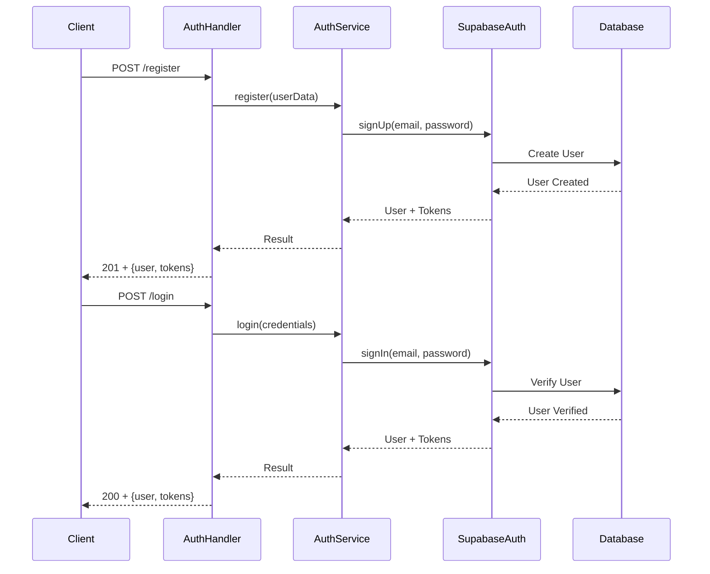
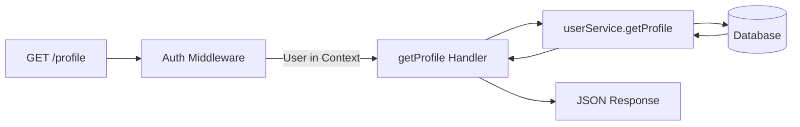
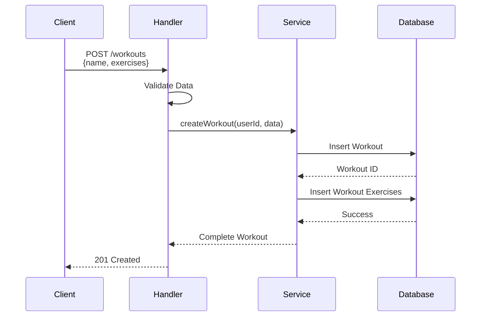
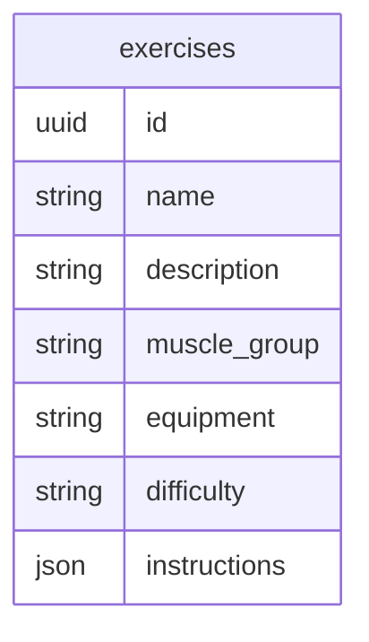
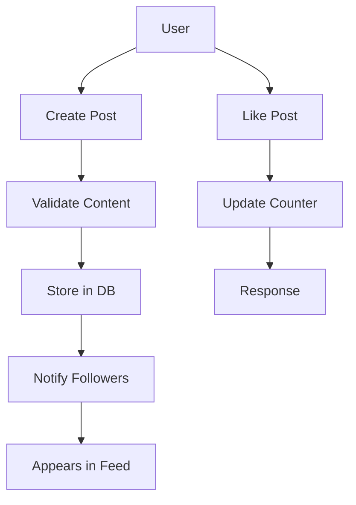
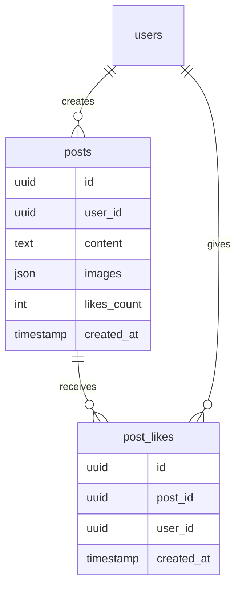
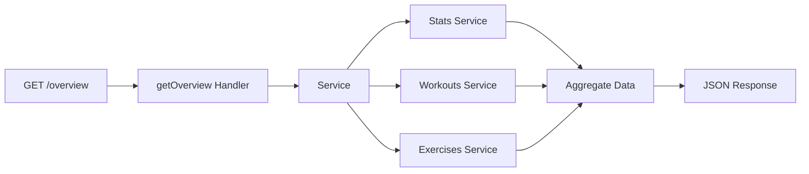
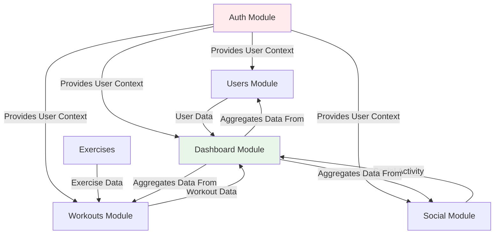

# Modules Documentation

This documentation describes each module of the GymPal Backend system, its endpoints, functionalities and data flow.

## 📋 Table of Contents

- [Auth Module](#auth-module)
- [Users Module](#users-module)
- [Workouts Module](#workouts-module)
- [Exercises Module](#exercises-module)
- [Social Module](#social-module)
- [Dashboard Module](#dashboard-module)
- [Personal Module](#personal-module)
- [Settings Module](#settings-module)

---

## 🔐 Auth Module

**Base Route:** `/api/v1/auth`

### Description
Module responsible for all authentication and authorization in the system. Handles registration, login, logout, token management and passwords.

### Authentication Flow



### Endpoints

| Method | Route | Description | Auth Required |
|--------|------|-------------|---------------|
| POST | `/register` | Registers a new user | No |
| POST | `/login` | Authenticates a user | No |
| GET | `/me` | Gets authenticated user information | Yes |
| POST | `/logout` | Closes user session | Yes |
| POST | `/refresh` | Renews access token | No |
| POST | `/reset-password` | Resets password with token | No |
| PUT | `/{id}/change-password` | Changes user password | Yes |
| DELETE | `/{id}` | Deletes user account | Yes |

### Handlers

- `register`: Creates a new user and generates tokens
- `login`: Authenticates user and returns tokens
- `getMe`: Gets authenticated user information
- `logout`: Closes session
- `refresh`: Renews access tokens
- `resetPassword`: Resets password
- `changePassword`: Changes password
- `deleteAccount`: Deletes account

---

## 👥 Users Module

**Base Route:** `/api/v1/users`

### Description
Module for user profile management, user search and user statistics.

### Get Profile Flow



### Endpoints

| Method | Route | Description | Auth Required |
|--------|------|-------------|---------------|
| GET | `/profile` | Gets authenticated user's profile | Yes |
| PUT | `/profile` | Updates user profile | Yes |
| GET | `/{id}` | Gets public information of a user | Yes |
| GET | `/search` | Searches users by name or username | Yes |
| GET | `/stats` | Gets user statistics | Yes |

### Handlers

- `getProfile`: Gets complete authenticated user profile with statistics included
- `updateProfile`: Updates profile information
- `getById`: Gets public information of a user
- `search`: Searches users with filters
- `getStats`: Gets aggregated user statistics

### Response Format

#### GET `/profile`

Returns user profile with embedded statistics:

```json
{
  "success": true,
  "data": {
    "id": "uuid",
    "email": "user@example.com",
    "username": "fitnesslover",
    "fullName": "John Doe",
    "avatar": "url",
    "createdAt": "2024-01-15T10:30:00Z",
    "stats": {
      "totalWorkouts": 45,
      "totalExercises": 120,
      "totalPosts": 23
    }
  }
}
```

The `stats` object contains aggregated statistics:
- `totalWorkouts`: Total number of workouts created by the user
- `totalExercises`: Total number of exercises created by the user
- `totalPosts`: Total number of social posts created by the user

---

## 💪 Workouts Module

**Base Route:** `/api/v1/workouts`

### Description
Module for managing workouts, routines and exercises within workouts.

### Create Workout Flow



### Endpoints

| Method | Route | Description | Auth Required |
|--------|------|-------------|---------------|
| POST | `/` | Creates a new workout | Yes |
| GET | `/` | Lists user workouts | Yes |
| GET | `/{id}` | Gets a specific workout | Yes |
| PUT | `/{id}` | Updates a workout | Yes |
| DELETE | `/{id}` | Deletes a workout | Yes |

### Handlers

- `createWorkout`: Creates a new workout
- `listWorkouts`: Lists workouts with filters
- `getWorkout`: Gets workout details
- `updateWorkout`: Updates a workout
- `deleteWorkout`: Deletes a workout

---

## 🏋️ Exercises Module

**Base Route:** `/api/v1/exercises`

### Description
Module for managing the catalog of exercises available in the system.

### Data Structure



### Endpoints

| Method | Route | Description | Auth Required |
|--------|------|-------------|---------------|
| GET | `/` | Lists exercises with filters | Yes |
| GET | `/{id}` | Gets a specific exercise | Yes |
| POST | `/` | Creates a new exercise (admin) | Yes |
| PUT | `/{id}` | Updates an exercise (admin) | Yes |
| DELETE | `/{id}` | Deletes an exercise (admin) | Yes |

### Handlers

- `listExercises`: Lists exercises with filters and pagination
- `getExercise`: Gets exercise details
- `createExercise`: Creates a new exercise
- `updateExercise`: Updates an exercise
- `deleteExercise`: Deletes an exercise

---

## 🌐 Social Module

**Base Route:** `/api/v1/social`

### Description
Module for social features: posts, likes, comments and interactions between users.

### Social Post Flow



### Endpoints

| Method | Route | Description | Auth Required |
|--------|------|-------------|---------------|
| POST | `/posts` | Creates a new post | Yes |
| GET | `/posts` | Lists posts with filters | Yes |
| GET | `/posts/{id}` | Gets a specific post | Yes |
| PUT | `/posts/{id}` | Updates a post | Yes |
| DELETE | `/posts/{id}` | Deletes a post | Yes |
| POST | `/posts/{id}/like` | Likes a post | Yes |
| DELETE | `/posts/{id}/like` | Removes like from a post | Yes |

### Handlers

- `createPost`: Creates a new social post
- `listPosts`: Lists posts with filters, pagination, and enriched author information
- `getPost`: Gets post details with author information, likes, and comments count
- `updatePost`: Updates a post (author only)
- `deletePost`: Deletes a post (author only)
- `likePost`: Likes a post
- `unlikePost`: Removes like from a post

### Response Format

#### GET `/posts`

Returns paginated list of posts with enriched information:

```json
{
  "success": true,
  "data": [
    {
      "id": "uuid",
      "content": "Post content",
      "image_urls": [],
      "hashtags": [],
      "workout_id": "uuid",
      "is_public": true,
      "createdAt": "2024-01-15T10:30:00Z",
      "updatedAt": "2024-01-15T10:30:00Z",
      "author": {
        "id": "uuid",
        "username": "fitnesslover",
        "fullName": "John Doe",
        "avatar": "url"
      },
      "likesCount": 42,
      "commentsCount": 5,
      "isLiked": false
    }
  ],
  "pagination": {
    "page": 1,
    "limit": 20,
    "total": 100,
    "totalPages": 5,
    "hasNext": true,
    "hasPrev": false
  }
}
```

Each post includes:
- **author**: Complete author information (id, username, fullName, avatar)
- **likesCount**: Total number of likes on the post
- **commentsCount**: Total number of comments on the post
- **isLiked**: Whether the authenticated user has liked this post

#### GET `/posts/{id}`

Returns a single post with the same enriched format as the list endpoint.

### Data Model



---

## 📊 Dashboard Module

**Base Route:** `/api/v1/dashboard`

### Description
Module that provides an overview and statistics of user activity.

### Dashboard Flow



### Endpoints

| Method | Route | Description | Auth Required |
|--------|------|-------------|---------------|
| GET | `/overview` | Gets complete dashboard summary | Yes |
| GET | `/stats` | Gets statistics by period | Yes |
| GET | `/activity` | Gets recent activity | Yes |

### Handlers

- `getOverview`: Provides complete dashboard summary
- `getStats`: Gets detailed statistics by period (week, month, year)
- `getRecentActivity`: Gets list of recent activities

### Data Provided

- Total workouts
- Total exercises performed
- Total training time
- Weight progress
- Recent workouts
- Unlocked achievements

---

## 👤 Personal Module

**Base Route:** `/api/v1/personal`

### Description
Module for managing user personal data: health information, goals, body measurements, etc.

### Endpoints

| Method | Route | Description | Auth Required |
|--------|------|-------------|---------------|
| GET | `/info` | Gets personal physical information | Yes |
| PUT | `/info` | Updates personal physical information | Yes |
| GET | `/fitness-profile` | Gets fitness profile | Yes |
| PUT | `/fitness-profile` | Updates fitness profile | Yes |

### Handlers

- `getInfo`: Gets personal physical information (age, weight, height, body fat)
- `updateInfo`: Updates personal physical information
- `getFitnessProfile`: Gets fitness profile (experience level, goals, preferences)
- `updateFitnessProfile`: Updates fitness profile

### Response Format

#### GET `/info`

Returns personal information with null values for fields that haven't been set yet (prevents 404 errors):

```json
{
  "success": true,
  "data": {
    "age": null,
    "weight_kg": null,
    "height_cm": null,
    "body_fat_percentage": null,
    "updated_at": null
  }
}
```

This ensures the frontend always receives a valid response structure, even when the user hasn't completed their personal information yet.

#### GET `/fitness-profile`

Similar behavior - returns fitness profile with null values for unset fields:

```json
{
  "success": true,
  "data": {
    "experience_level": null,
    "primary_goal": null,
    "secondary_goals": null,
    "workout_frequency": null,
    "updated_at": null
  }
}
```

---

## ⚙️ Settings Module

**Base Route:** `/api/v1/settings`

### Description
Module for managing user settings and preferences.

### Endpoints

| Method | Route | Description | Auth Required |
|--------|------|-------------|---------------|
| GET | `/` | Gets all settings | Yes |
| PUT | `/` | Updates settings | Yes |
| GET | `/notifications` | Gets notification preferences | Yes |
| PUT | `/notifications` | Updates notification preferences | Yes |
| GET | `/privacy` | Gets privacy settings | Yes |
| PUT | `/privacy` | Updates privacy settings | Yes |

### Handlers

- `getSettings`: Gets all settings
- `updateSettings`: Updates settings
- `getNotificationSettings`: Gets notification preferences
- `updateNotificationSettings`: Updates notification preferences
- `getPrivacySettings`: Gets privacy settings
- `updatePrivacySettings`: Updates privacy settings

---

## 🔄 Module Relationships


